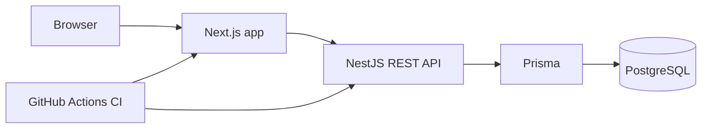
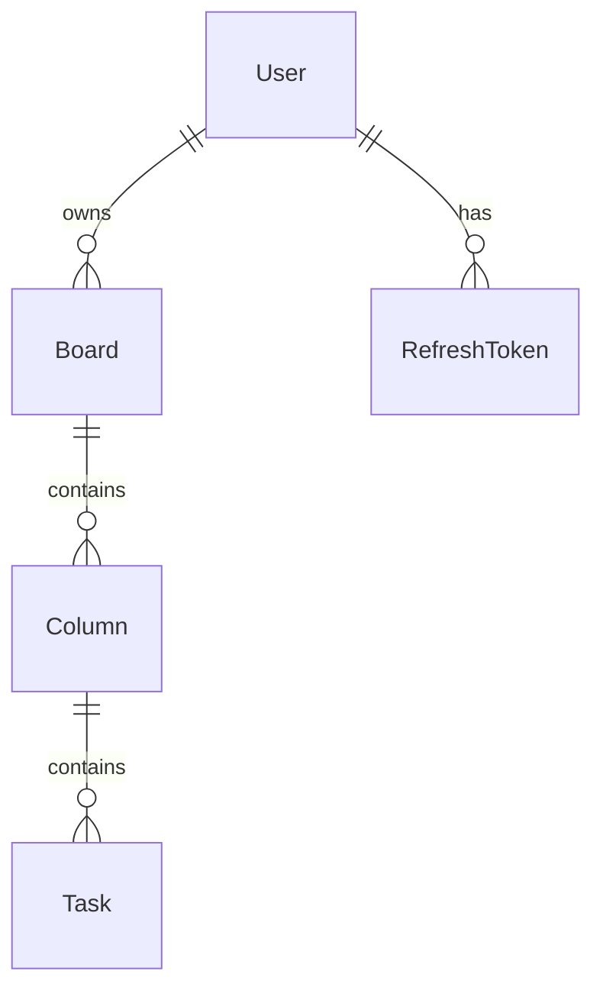

# DevBoard

DevBoard is a full stack Kanban project management application built to demonstrate professional React, Next.js, NestJS, PostgreSQL, Prisma, authentication, authorization, tests, Docker, CI and deployment readiness.

## Screenshots

Screenshots should be added after running the application locally or deploying it. No placeholder images are committed.

## Live Demo

Prepared for deployment. Add the Vercel and API URLs here after deploy.

## Features

- Public landing page with product positioning and CTAs.
- Register, login, logout, refresh token and `/auth/me`.
- JWT authentication with hashed refresh tokens.
- Protected dashboard with board and task metrics.
- Board CRUD with automatic default columns.
- Kanban board with task creation, filters and drag-and-drop movement.
- Persisted task ordering and cross-column moves.
- Backend ownership checks for boards, columns and tasks.
- Swagger documentation at `/docs`.
- Health check at `/health` with database connectivity.
- Tailwind UI with dark mode, loading, empty and error states.
- Unit/component tests, lint, typecheck, build and GitHub Actions CI.

## Tech Stack

- Frontend: Next.js App Router, React, TypeScript, Tailwind CSS, TanStack Query, React Hook Form, Zod, dnd-kit, Sonner, Lucide.
- Backend: NestJS, TypeScript, Prisma, PostgreSQL, Passport JWT, Argon2, Swagger, Helmet, Throttler, class-validator.
- Database: PostgreSQL 16, Prisma migrations and seed.
- DevOps: pnpm workspaces, Docker Compose, Dockerfiles, GitHub Actions, Husky, lint-staged.
- Testing: Jest for API, Vitest and React Testing Library for web.

## Architecture



The API is the only service that talks to PostgreSQL. The frontend uses a small API client that attaches the JWT access token and delegates server data caching to TanStack Query.

## Database Model



## Local Development

```bash
pnpm install
docker compose up -d
pnpm prisma:migrate
pnpm prisma:seed
pnpm dev
```

Local URLs:

- Frontend: `http://localhost:3000`
- API: `http://localhost:3001`
- Swagger: `http://localhost:3001/docs`
- Health: `http://localhost:3001/health`

Demo user after seed:

- Email: `demo@devboard.local`
- Password: `Demo1234`

## Environment Variables

Copy the examples before running locally:

```bash
cp apps/api/.env.example apps/api/.env
cp apps/web/.env.example apps/web/.env.local
```

Required API variables:

- `DATABASE_URL`
- `JWT_ACCESS_SECRET`
- `JWT_REFRESH_SECRET`
- `JWT_ACCESS_EXPIRES_IN`
- `JWT_REFRESH_EXPIRES_IN`
- `CORS_ORIGIN`
- `PORT`
- `NODE_ENV`

Required web variable:

- `NEXT_PUBLIC_API_URL`

## Testing

```bash
pnpm lint
pnpm typecheck
pnpm test
pnpm build
```

## CI/CD

GitHub Actions runs install, Prisma Client generation, lint, typecheck, tests and build on `push` and `pull_request`. PostgreSQL is available as a service container for future integration tests.

## API Documentation

Run the API and open `http://localhost:3001/docs` for Swagger/OpenAPI documentation.

## Deployment

Frontend deployment target: Vercel, project root `apps/web`.

Backend deployment target: Railway or Render using `apps/api/Dockerfile`.

Database target: managed PostgreSQL such as Neon.

Deployment variables must be configured in the host dashboards. No deploy was executed because external credentials are required.

## Engineering Decisions

- NestJS was chosen because modules, guards, pipes and Swagger support fit a portfolio API without custom framework plumbing.
- PostgreSQL is used because Kanban ownership, ordering and relational integrity benefit from transactions and constraints.
- Prisma provides type-safe database access and explicit migrations without hiding SQL modeling decisions.
- React Query owns server state because boards and tasks are remote resources, not global UI state.
- dnd-kit provides accessible drag-and-drop primitives without tying the UI to a heavy board framework.
- Task ordering uses numeric `position` fields scoped by column. Moves are persisted in a transaction and affected columns are reindexed.
- Authorization is guaranteed by backend service methods that load the board ownership chain before every mutation.
- Authentication uses short-lived access tokens and refresh token rotation with Argon2 hashes stored in the database.
- A pnpm monorepo keeps web and API together for CI and local development while preserving deployable app boundaries.

## Future Improvements

- Team workspaces and board members.
- Comments, attachments and activity log.
- RBAC for organization roles.
- Real-time updates with WebSockets.
- Notifications and due date reminders.
- Playwright e2e suite against a seeded local environment.
