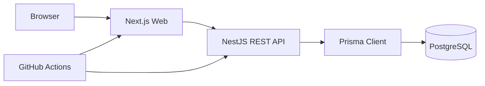

# Architecture

DevBoard is a small monorepo that keeps deployment boundaries explicit: `apps/web` is a Next.js App Router application and `apps/api` is a NestJS REST API. PostgreSQL is private to the API and accessed through Prisma.

## Frontend

The frontend uses React Query for server state, React Hook Form plus Zod for forms, Tailwind CSS for styling, Sonner for toasts, and dnd-kit for Kanban interactions. Authentication state is stored client-side as tokens and attached to API calls through the API client.

## Backend

NestJS modules are organized by domain. Controllers expose REST endpoints and services enforce business rules. Ownership is checked against the database before returning or mutating boards, columns, and tasks.

## Authentication

Registration and login issue short-lived access tokens and refresh tokens. Refresh tokens are hashed with Argon2 before persistence and revoked during logout or refresh rotation.

## Request Flow

The browser renders the Next.js app, calls the API with a Bearer token, and receives JSON. The API validates DTOs globally, checks guards, applies ownership rules, and persists through Prisma.

## Deploy

The web app is prepared for Vercel from `apps/web`. The API includes a Dockerfile for Railway or Render. PostgreSQL should be provided by a managed service such as Neon.
