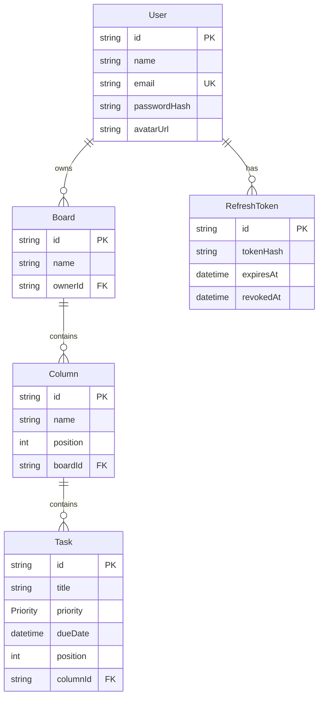

# Database

DevBoard uses PostgreSQL with Prisma migrations.

## Modeling Decisions

- `Board.ownerId` is indexed because every board query is scoped by user.
- `Column.boardId, position` and `Task.columnId, position` are indexed to keep ordered Kanban reads efficient.
- Cascading deletes keep child columns/tasks/session rows from becoming orphaned.
- Refresh tokens store only Argon2 hashes, never plaintext token values.
